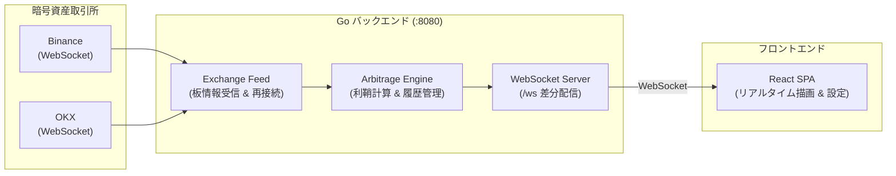

# Crypto Arbitrage Detector

暗号資産取引所（Binance および OKX）のオーダーブック（板情報）をリアルタイムに監視し、取引所間の価格差から手数料を差し引いた「純利益が見込める機会」を検知・可視化するツールです。

※ 本ツールは価格差の検知と画面表示のみを行い、自動発注は行いません。

---

## 主な特徴

- **リアルタイム検知**: 各取引所のWebSocketフィードを常時受信し、ミリ秒単位でオーダーブックを突き合わせて利鞘を算出。
- **実効利益の計算**: 単純な最良気配の比較だけでなく、板の厚み（深さ）とtaker手数料率（往復分）を考慮した現実的な利益を試算。
- **直感的なダッシュボード**: 有利な売買方向、推定純利益、各取引所の最良気配、検知履歴をリアルタイムに表示。
- **シングルコンテナ配信**: ビルド済みReactフロントエンドをGoバイナリに内包し、単一のコンテナでシンプルに稼働。

---

## アーキテクチャ



---

## 技術スタック

- **バックエンド**: Go, Gorilla WebSocket, Decimal
- **フロントエンド**: React, TypeScript, Vite, Biome
- **インフラ**: Docker, Docker Compose

---

## クイックスタート

Docker環境があれば、ローカルにGoやNode.jsをインストールすることなく起動できます。

```bash
# 本番相当（単一コンテナで起動）
docker compose up --build
```

起動後、ブラウザで `http://localhost:8080` にアクセスします。

### 開発環境での起動

```bash
# バックエンドとフロントエンドをホットリロード付きで起動
make dev
```

- フロントエンド（開発UI）: `http://localhost:3000`
- バックエンド（API / WebSocket）: `http://localhost:8080`

---

## 主なコマンド

```bash
make fmt    # コード整形（Go: gofmt/goimports, TS: Biome）
make test   # テスト実行（競合状態検知付き）
make lint   # 静的解析（golangci-lint, 型検査, Biome）
```

---

## 設定方法

監視対象の通貨ペアや取引所の手数料率は `backend/config.json` で管理されています。

```json
{
  "server": {
    "addr": ":8080"
  },
  "pairs": [
    "BTC/USDT",
    "ETH/USDT"
  ]
}
```

- **通貨ペアの追加**: `pairs` 配列に `"SOL/USDT"` などのシンボルを追記して再起動するだけで、自動的に監視が開始されます。
- **環境変数による上書き**: `ARB_CONFIG` で任意の設定JSONファイルを指定できるほか、`ARB_ADDR` や `ARB_LOG_LEVEL` などの環境変数にも対応しています。

---

## ディレクトリ構成

```text
crypto-arbitrage-detector/
├── backend/
│   ├── cmd/server/            # サーバー起動・エントリポイント
│   ├── internal/
│   │   ├── arbitrage/         # 板突き合わせ・利鞘計算ロジック
│   │   ├── engine/            # 板の保持・判定・機会の履歴管理
│   │   ├── exchange/          # 取引所別WebSocketクライアント（Binance / OKX）
│   │   └── server/            # クライアント配信・HTTPハンドラ
│   └── config.json            # 通貨ペア・取引所設定
└── frontend/
    └── src/
        ├── components/        # UIコンポーネント（カード、ヘッダー、履歴等）
        ├── state/             # リアルタイム状態管理
        └── ws/                # 自動再接続付きWebSocketクライアント
```
