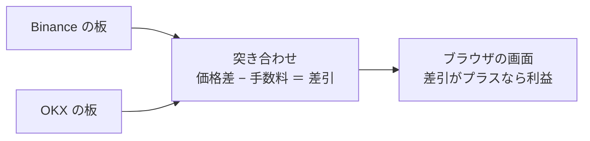
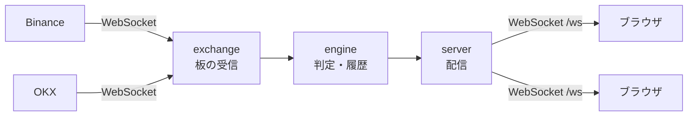

# Crypto Arbitrage Detector

同じ暗号資産を「安い取引所で買って、高い取引所で売る」と、手数料を払っても利益が残る瞬間を見つけて表示するツールです。対象は Binance と OKX。

**注文は出しません。見つけて表示するだけです。**



| 用語 | 意味 |
| --- | --- |
| 板 | 取引所に出ている買い注文と売り注文の一覧。価格ごとに数量が並ぶ |
| 買値 (ask) | いま買える値段（いちばん安い売り注文） |
| 売値 (bid) | いま売れる値段（いちばん高い買い注文） |
| 手数料 | 板の注文をすぐ取る取引（taker）にかかる率。既定は両取引所とも 0.1% |
| 差引 | 価格差から手数料を引いた残り。プラスなら利益、マイナスなら赤字 |

## 画面の見方

上から順に、大事なものほど上にあります。文章ではなく数字とラベルで読めるようにしています。

| 場所 | 分かること |
| --- | --- |
| 右上 | 接続の状態。「Binance・OKXに接続中」なら正常。切れると「再接続中…」が出る |
| 緑の帯（利益があるときだけ） | 「BTC/USDT　Binanceで買い → OKXで売り　+0.133 USDT」のように、ペア・方向・利益 |
| 取引金額 | いくらぶん売買するか（既定 100 USDT）。式も履歴もこの金額で計算する |
| 通貨ペアの枠（PC では 2 列） | ペアごとの判定。読み方は下の「通貨ペアの枠」。見出しの右に「利益あり / 利益なし / データ待ち」 |
| 検知履歴 | 利益が出ていた期間を 1 件として、時刻・取引・最大純利益・継続時間 |
| 最下段 | 計算に使っている手数料。ⓘ を押すと根拠と公式ページへのリンク |

### 板の読み方

板は、取引所に出ている「この値段で売りたい」「この値段で買いたい」という注文を、価格順に並べた表です。上半分が売り注文、下半分が買い注文で、真ん中に近いほど条件のよい注文です。

```
                 価格      数量
売り注文 (ask)   60,300    1.0 BTC      ↑ 高い
                 60,100    0.5 BTC
                 60,000    0.3 BTC   ← 買値: いま買うならこの値段。この値段で買えるのは 0.3 BTC まで
                 ─────────────────      すき間（スプレッド）。ここに注文はない
                 59,990    0.8 BTC   ← 売値: いま売るならこの値段。この値段で売れるのは 0.8 BTC まで
買い注文 (bid)   59,950    2.0 BTC
                 59,900    1.5 BTC      ↓ 安い
```

- **買値 (ask)** は売り注文のいちばん安いもの、**売値 (bid)** は買い注文のいちばん高いもの。すぐ売買するならこの値段になる
- **数量**は、その値段で取引できる量。上の例で 0.5 BTC 買うと、0.3 BTC は 60,000 で、残り 0.2 BTC は次の段の 60,100 で買うことになり、平均の値段が上がる
- 同じ取引所では必ず **売値 < 買値**。1 つの取引所で買ってすぐ売り戻しても、すき間と手数料のぶん損をする

### 2 つの板をこう使う

このアプリは Binance と OKX の板を横に並べ、「片方の買値」と「もう片方の売値」を突き合わせます。同じ取引所では売値 < 買値なので、利益が出るとすれば取引所をまたいだときだけです。

```
Binance の板                             OKX の板
  60,300    1.0 BTC                        60,400    1.0 BTC
  60,100    0.5 BTC                        60,250    0.8 BTC
  60,000    0.3 BTC   ← 買値 [買]           60,210    0.5 BTC
  ─────────────────                        ─────────────────
  59,990    0.8 BTC                        60,200    0.2 BTC   ← 売値 [売]
  59,950    2.0 BTC                        60,150    0.4 BTC
  59,900    1.5 BTC                        60,050    1.0 BTC
```

**1. 方向を決める。** 両方向を計算し、有利な方を枠に出します（手数料は両取引所とも 0.1% として計算）。

| 方向 | 買値 | 売値 | 価格差 (1 BTC) | 手数料 | 差引 | |
| --- | --- | --- | --- | --- | --- | --- |
| Binance で買い → OKX で売り | 60,000 | 60,200 | +200 | 120.2 | **+79.8** | 利益あり |
| OKX で買い → Binance で売り | 60,210 | 59,990 | −220 | 120.2 | −340.2 | 利益なし |

**2. いくらまで利益が出るかを、段を 1 つずつ突き合わせて数える。** 買う側は安い段から、売る側は高い段から使い、差引がプラスの段だけ数量を積み上げ、マイナスになったら止めます。

| | 買う（Binance の ask） | 売る（OKX の bid） | 差引 (1 BTC) | 積む数量 |
| --- | --- | --- | --- | --- |
| 1 段目 | 60,000 | 60,200 | +79.8 | 0.2 BTC（OKX の 60,200 を使い切る） |
| 2 段目 | 60,000 | 60,150 | +29.9 | 0.1 BTC（Binance の 60,000 を使い切る） |
| 3 段目 | 60,100 | 60,150 | −70.3 | 赤字なので止める |
| 合計 | | | | **0.3 BTC、純利益 18.95 USDT** |

**3. 受け取っている段には限りがある。** Binance は上位 20 段、OKX は上位 5 段だけを受け取ります。プラスのまま段を使い切ったら、「取得済みの板の範囲での値です（実際はもっと多い可能性があります）」と添えます。

**4. 古さは時間ではなく接続で判断する。** 取引所との接続が切れたらその板を捨て、つなぎ直して新しい板が届くまで判定しません（「古いデータの扱い」）。

### 通貨ペアの枠

上の例を取引金額 100 USDT で見ると、枠はこうなります。

```
BTC/USDT                                            利益あり

               Binanceで買い → OKXで売り
          +0.3333   −   0.2003   =   +0.133
           価格差       手数料        差引
              0.00166666 BTC ≈ 100 USDT

取引所      買値 (ask)          売値 (bid)         更新
Binance     [買] 60,000         59,990             0.3秒前
OKX         60,210              [売] 60,200        0.5秒前
```

- **方向と式**: 有利な方向と、取引金額ぶんの「価格差 − 手数料 ＝ 差引」。利益がないときは差引がマイナスで、その大きさが利益までの距離
- **数量**: 取引金額 ÷ 買値（100 ÷ 60,000）。板で利益が出る量（上の例では 0.3 BTC）を超える金額を入れると、その量で計算し「板で利益が出るのは 0.3 BTC（約 18,000 USDT）まで」と添える
- **価格の表**: 各取引所の買値・売値（板の 1 段目）と、板が最後に更新されてからの時間。使う 2 つの価格に色と「買」「売」の札が付く。段ごとの数量は「板で利益が出る量」の計算にだけ使い、表には出さない

### 色

色は意味ごとに決めています。ラベルには色を付けないので、色が付いていれば値か操作です。

| 色 | 意味 |
| --- | --- |
| 青 | 買い（買う取引所の買値、「〜で買い」、選んでいるもの） |
| 橙 | 売り |
| 緑 | 利益、接続が正常 |
| 赤 | 赤字、問題（接続が切れた、入力が不正） |
| 黄 | 注意 |

### 操作

- **並び替え**: カード左上の取っ手（⋮⋮）か、カードの上の「表示するペア」のチップをドラッグ。キーボードなら取っ手は ↑↓、チップは ←→
- **表示・非表示**: 「表示するペア」のチップ、またはカード右上の目のボタン。「すべて表示」で戻せる。隠したペアでも利益が出れば緑の帯とタブのタイトルに出る
- **配色・言語**: 右上でライト / ダーク、日本語 / English を切り替える。配色は選ぶまで OS の設定に従う
- **タブのタイトル**: 利益が出ている間は `● BTC +0.13` のような目印が付く
- 値が変わった箇所は一瞬背景が濃くなる。並び順・表示・配色・言語はブラウザに保存される

## 動かし方

Go も Node.js もローカルに入れずに済むように、どちらも Docker で動きます。

| | 本番相当 | 開発 |
| --- | --- | --- |
| コマンド | `docker compose up --build` | `make dev` |
| 画面 | http://localhost:8080 | http://localhost:3000（バックエンドは 8080） |
| ソースの変更 | 反映されない（ビルド済みの画面を配信） | 自動で反映（画面は数秒、バックエンドは再起動） |

設定（通貨ペアなど）は `backend/config.json` にあります。変えたら起動し直すだけで反映されます（本番相当はビルド時に埋め込むので `docker compose up --build` で作り直す。`make dev` は自動で再起動する）。

### 検査

```bash
make fmt    # 整形（Go: gofmt + goimports、TypeScript: Biome。安全な自動修正も適用）
make test   # テスト
make lint   # 静的検査（golangci-lint、型検査、Biome）
```

- 細かいタスクは `backend/Makefile`（`make help` で一覧）と `frontend/package.json` の scripts にあります
- ローカルのツールを使うなら `make test GO=go`、`make frontend-lint FRONTEND_SH="cd frontend && sh -c"` のように切り替えられます
- Claude Code / Codex で作業するときは、`.claude/hooks/format-lint.sh` がファイルの編集直後と応答の終わりに、変更のあった側の整形と lint を Docker で実行します。lint の指摘が残っていればエージェントに差し戻されます。Codex の初回設定は [.claude/hooks/README.md](.claude/hooks/README.md) を参照してください

## 検知のしくみ

### 何を比べるか

| | Binance | OKX |
| --- | --- | --- |
| 受け取る板 | 上位 20 段、100ms ごと | 上位 5 段、変化があったとき（100ms） |
| 接続 | 常時接続（WebSocket） | 常時接続（WebSocket） |

通貨ペアは `backend/config.json` の `pairs` に書いたもの（`BASE/QUOTE` 形式、いくつでも）。全ペアを両取引所で同じように扱います。

### 利益の計算式

「買う取引所の買値で買い、売る取引所の売値で売る」と考えます。どちらも板の注文をすぐ取る取引なので、手数料は taker の率です。

```
1 単位の差引 = 売値 × (1 − 売る側の手数料率) − 買値 × (1 + 買う側の手数料率)
```

- この式がプラスの段だけを突き合わせて数量を積み上げる（「2 つの板をこう使う」）。純利益 = 売った代金 − 買った代金 − 両方の手数料
- 数量に固定の上限・下限はない。受け取った板の段数が事実上の上限
- 手数料は、買いは代金に上乗せ、売りは受取から差し引いて USDT にそろえる。率は取引所ごとに設定の `takerFeeRate` で決まり、サーバー全体に共通（閲覧者ごとには変えられない）
- 同じ取引所では売値 < 買値なので、両方向が同時に利益になることはない

### 「機会」＝履歴の 1 件

ある通貨ペア・方向で差引がプラスになった瞬間から、プラスでなくなる（または接続が切れる）までを 1 件と数えます。継続中は最大純利益と、そのときの数量・平均価格を更新します。履歴はメモリに最新 200 件（`history.limit`）だけ持ち、サーバーを再起動すると消えます。

### 古いデータの扱い

「n 秒より古いデータは使わない」という時間の決まりはありません。板の更新頻度は相場次第で（OKX は変化があったときしか送ってきません）、時間では新しさを判断できないからです。

代わりに、取引所との接続が切れたらその取引所の板をすべて捨て、つなぎ直して新しい板が届くまで判定しません。各板の最終更新からの経過時間は画面に出しています。接続の生存は ping/pong と受信タイムアウトで見張り、切れたら間隔を広げながら再接続します。

### 注意

- 表示する利益は、板のその瞬間の値から計算した理論値です。実際には、注文が届くまでの板の変化、取引所間の資金移動、最小注文数量や刻み、手数料ランクの違いで結果が変わります
- 投資の助言ではありません。注文も出しません

## 設定

設定は `backend/config.json` に書き、ビルド時にバイナリへ埋め込みます。通貨ペアの追加のような普段の変更はこのファイルを編集して起動し直すだけで、ファイルの配置や環境変数は要りません。

イメージを作り直さずに一部だけ変えたいときは、環境変数 `ARB_CONFIG` で別の JSON ファイルを渡します（書いたキーだけ上書き。`docker-compose.yml` にコメントで例があります）。優先順位は「`backend/config.json` → `ARB_CONFIG` のファイル → 環境変数」です。JSON に知らないキーがあるとエラーにします（タイプミスに気づけるように）。

| キー | 値（`backend/config.json`） | 説明 |
| --- | --- | --- |
| `server.addr` | `":8080"` | 待ち受けアドレス |
| `server.allowedOrigins` | `[]` | WebSocket 接続を許可する追加の Origin。同一オリジンは常に許可 |
| `exchanges[].id` | `binance`, `okx` | 取引所 ID（`backend/internal/exchange/registry` に登録されているもの） |
| `exchanges[].name` | 取引所ごとの既定名 | 表示名 |
| `exchanges[].takerFeeRate` | `"0.001"` | taker 手数料率（0.001 = 0.1%） |
| `exchanges[].wsUrl` | 取引所ごとの既定 URL | 接続先の上書き。テストやプロキシ用 |
| `pairs` | `["BTC/USDT", ...]` | 監視する通貨ペアの一覧（`BASE/QUOTE` 形式。1 つ以上、重複不可） |
| `history.limit` | `200` | 保持する履歴の件数 |
| `log.level` | `"info"` | `debug` / `info` / `warn` / `error` |
| `log.format` | `"text"` | `text` / `json` |

環境変数: `ARB_CONFIG`（設定ファイルのパス）、`ARB_ADDR`、`ARB_LOG_LEVEL`、`ARB_LOG_FORMAT`

API キーのような機密情報は使いません（公開のマーケットデータだけを読みます）。将来必要になっても環境変数で渡し、リポジトリには入れません。

### 通貨ペア・取引所を増やす

- **通貨ペア**: `backend/config.json` の `pairs` に `"SOL/USDT"` のように書き足して起動し直すだけ。コードにペアの一覧はなく、取引所ごとのシンボル表記（`SOLUSDT`、`SOL-USDT`）も画面のカードも自動で組み立てる。取引金額の単位は先頭のペアの Quote 通貨で表示するので、Quote 通貨はそろえておく
- **取引所**: `backend/internal/exchange/` に `exchange.Feed` を実装したパッケージを作り、`registry` に登録する。全組み合わせを評価するので 3 つ以上でも動く

## 構成

バックエンドは Go、フロントエンドは React + TypeScript（Vite）。ビルドした画面は Go のバイナリに埋め込むので、動かすコンテナは 1 つです。



```
backend/
  config.json            設定（通貨ペア・取引所・手数料率など）。ビルド時にバイナリへ埋め込む
  cmd/server/            起動処理（設定の読み込み、終了シグナル、ヘルスチェック）
  internal/
    domain/              通貨ペア・板などの基本の型
    arbitrage/           板を突き合わせて差引を計算する部品（計算だけで副作用なし）
    engine/              板の保持、両方向の判定、機会の履歴、接続状態
    exchange/            取引所と共通のつなぎ方、再接続付き WebSocket クライアント
      binance/ okx/      取引所ごとの購読と解析
      registry/          取引所 ID から実装を引く
    server/              ブラウザ向け配信（クライアントごとに最新の状態だけ送る）
    wire/                配信する JSON の形式
    config/              設定の読み込みと検証
    webui/               ビルド済み画面の埋め込み配信
    app/                 各部品の組み立て
frontend/
  src/
    protocol/            サーバーから届くメッセージの型と検証
    state/               届いたメッセージを画面用の状態に反映する
    ws/                  自動再接続付き WebSocket クライアント
    hooks/               受信・タブ通知・設定の保存など
    components/          画面の部品
    i18n/                日本語 / 英語の文言（初回はブラウザの言語設定、以後は画面で切り替え）
    format/              10 進文字列の表示整形
```

### 配信の形式（サーバー → ブラウザ、`/ws`）

つないだ直後に `init` を 1 回送り、その後は変化があったものだけを送ります。金額と数量は文字列、時刻は UTC の ISO 8601 です。

| `type` | 内容 |
| --- | --- |
| `init` | `exchanges`, `pairs`, `history`, `seq` |
| `pair` | 通貨ペア 1 つ分の最新の判定 |
| `episode` | 機会の開始・最大値の更新・終了 |
| `exchange` | 取引所の接続状態の変化 |

- `seq` はサーバー全体で増え続ける通し番号。受信側が `init` より前のイベントを捨てるのに使う
- 配信側はクライアントごとに「対象ごとの最新メッセージ」だけを持つ。読み出しの遅いクライアントがいても待ち行列が伸びず、ほかのクライアントに影響しない

URL: `/`（画面）、`/ws`（配信）、`/healthz`（生存確認と取引所の接続状態）

## 開発の方針

- テストには仕様を説明する名前を付け、仕様を変えるときはまずテストを変えてから実装する
- CI（GitHub Actions）で、整形・vet・データ競合検出付きテスト・golangci-lint・govulncheck・型検査・Biome・ビルド・Docker イメージの起動確認・機密情報の混入検査（gitleaks）を回す

### 依存を安全に保つ

- Go の依存は `gorilla/websocket` と `shopspring/decimal` の 2 つだけ（どちらも推移的依存なし）。`go.sum` と Go のチェックサム DB で検証する
- フロントエンドの実行時依存は `react` と `react-dom` だけ。lint と整形は Biome 1 つ、TSX の変換は Vite 内蔵の機能で、Babel 系のプラグインは入れない
- Yarn（Berry）は依存のインストール時スクリプトを禁止し（`enableScripts: false`）、公開から 7 日経っていないバージョンは取り込まない（`npmMinimalAgeGate`）。バージョンは完全に固定する
- Docker のベースイメージはハッシュ（digest）で固定し、実行イメージは最小構成（シェルなし、非 root）。GitHub Actions はコミット SHA で固定する
- Dependabot は 7 日のクールダウンを置いてから更新を提案する
